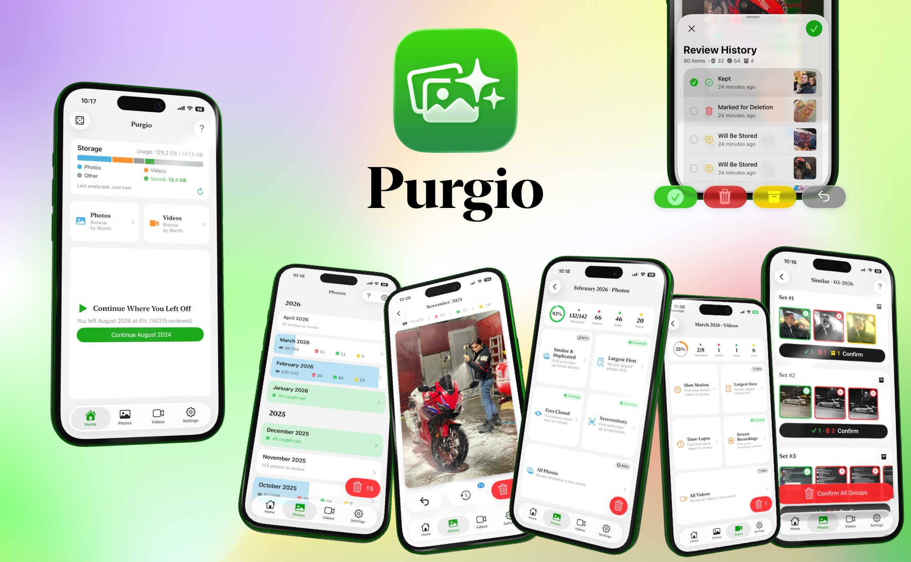

# secure-photo-cleaner-app

  

# Purgio

**Free, safe and simple photo cleanup for iPhone.** Native iOS, fully offline, ML-powered.

  

## Highlights

- **Fully offline.** Zero networking layer, no third-party SDKs, no analytics, no telemetry. The app makes no outbound HTTP requests. Photos never leave the device.
- **Native on-device ML.** Apple Vision powers similar-photo grouping (`VNGenerateImageFeaturePrintRequest`), and Core Image's `CIDetector` (`CIDetectorEyeBlink`) handles closed-eye detection. Similarity runs in time-windowed clusters to keep complexity bounded on large libraries.
- **iCloud-aware.** iCloud Photo Library assets are handled gracefully through `PHImageManager` with low-quality previews and explicit offline fallbacks. Network access for iCloud downloads is opt-in via Settings.
- **iOS 15+ support.** The audience that needs cleanup tools the most is on older devices where storage pressure is real. The app deliberately targets iOS 15.0 with availability guards around newer APIs, rather than dropping legacy users for the sake of newer SDK conveniences.
- **Tip Jar.** Three optional consumable in-app purchases as the only monetization. No paywalls, no subscriptions, no ads, no feature gates.

## What's in the app

- Month-by-month swipe review with auto-saved progress
- Filters: Screenshots, Large Files, Similar Photos, Eyes Closed, Slow Motion, Time Lapse, Screen Recordings
- "Will Be Stored" album for sentimental archival
- Storage analysis and impact stats

## Localization

Ships in English and Turkish, for now.

For adding a new language or updating existing translations, see the [Purgio Developer Localization Guide](Docs/Developer-Localization-Guide.md).

## Stack

Swift, UIKit, SwiftUI, PhotoKit, Vision, Core Image, StoreKit 2.

## Feedback

Feedback genuinely shapes this app. Bug reports, feature ideas, edge cases on older devices, translation suggestions, and general thoughts are all welcome and read carefully. Reach out from [here](mailto:zeynep.muslim@icloud.com).

---

Built by [Zeynep Müslim](https://www.zeynepmuslim.com).
